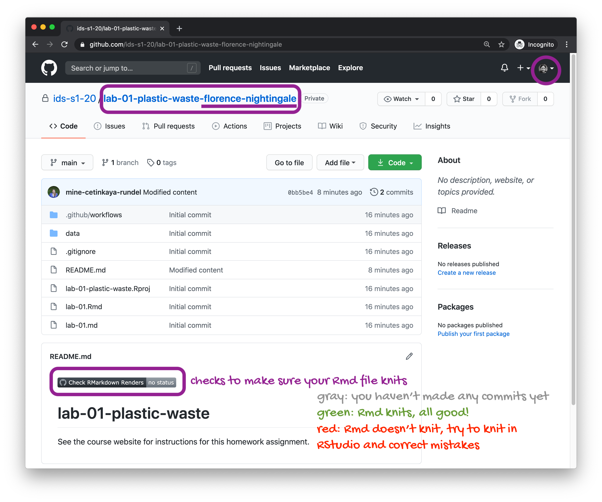

```{r include = FALSE}
knitr::opts_chunk$set(eval = FALSE)
```

Plastic pollution is a major and growing problem, negatively affecting oceans and wildlife health.
[Our World in Data](https://ourworldindata.org/plastic-pollution) has a lot of great data at various levels including globally, per country, and over time.
For this lab we focus on data from 2010.

Additionally, National Geographic ran a data visualization communication contest on plastic waste as seen [here](https://www.nationalgeographic.org/funding-opportunities/innovation-challenges/plastic/dataviz/).

# Learning goals

-   Visualising numerical and categorical data and interpreting visualisations
-   Recreating visualizations
-   Getting more practice using with R, RStudio, Git, and GitHub

# Getting started

Go to the course GitHub organization and locate your assignment repo, which should be named `lab-02-plastic-waste-YOUR_GITHUB_USERNAME`.
If you're in the right place, it should look like the following.

```{r echo=FALSE, eval=TRUE}

```

Grab the URL of the repo, and clone it in RStudio.
Refer to [HW 00](https://ids-s1-20.github.io/homework/hw-00/hw-00-pet-names.html) if you would like to see step-by-step instructions for cloning a repo into an RStudio project.

First, open the R Markdown document `lab-02.Rmd` and Knit it.
Make sure it compiles without errors.
The output will be in the file markdown `.md` file with the same name.

# Packages

We'll use the **tidyverse** package for this analysis.
Run the following code in the Console to load this package.

```{r load-packages, eval=TRUE}
library(tidyverse)
library(scales) # nice axis labels
library(janitor) # tabulations & clean names
```

# Data

The dataset for this assignment can be found as a csv file in the `data` folder of your repository.
You can read it in using the following.

```{r load-data, eval=TRUE}
plastic_waste <- read_csv("data/plastic-waste.csv") %>%
  clean_names()
```

The variable descriptions are as follows:

-   `code`: 3 Letter country code
-   `entity`: Country name
-   `continent`: Continent name
-   `year`: Year
-   `gdp_per_cap`: GDP per capita constant 2011 international \$, rate
-   `plastic_waste_per_cap`: Amount of plastic waste per capita in kg/day
-   `mismanaged_plastic_waste_per_cap`: Amount of mismanaged plastic waste per capita in kg/day
-   `mismanaged_plastic_waste`: Tonnes of mismanaged plastic waste
-   `coastal_pop`: Number of individuals living on/near coast
-   `total_pop`: Total population according to Gapminder

# Warm up

-   Recall that RStudio is divided into four panes. Without looking, can you name them all and briefly describe their purpose?
-   Verify that the dataset has loaded into the Environment. How many observations are in the dataset? Clicking on the dataset in the Environment will allow you to inspect it more carefully. Alternatively, you can type `View(plastic_waste)` into the Console to do this.

```{marginfigure}
**Hint:** If you're not sure, run the command `?NA` which will lead you to the documentation.
```

```{r warmup-glimpse, eval=TRUE}
glimpse(plastic_waste)
nrow(plastic_waste)
```

Interpretation: `glimpse()` confirms expected columns and types; `nrow()` reports the number of rows (observations) present in your local CSV.

-   Have a quick look at the data and notice that there are cells taking the value `NA` -- what does this mean?

**Q: What does `NA` mean?** 

**A:** `NA` represents a **missing value** (unknown/not recorded).
Many functions propagate `NA` unless you set `na.rm = TRUE` or handle missingness explicitly (e.g., imputation, filtering).

# Exercises

Let's start by taking a look at the distribution of plastic waste per capita in 2010.

```{r plastic_waste_per_cap-hist, eval=TRUE}
ggplot(data = plastic_waste, aes(x = plastic_waste_per_cap)) +
  geom_histogram(binwidth = 0.2)
```

One country stands out as an unusual observation at the top of the distribution.
One way of identifying this country is to filter the data for countries where plastic waste per capita is greater than 3.5 kg/person.

```{r plastic_waste_per_cap-max, eval=TRUE}
plastic_waste %>%
  filter(plastic_waste_per_cap > 3.5)
```

Did you expect this result?
You might consider doing some research on Trinidad and Tobago to see why plastic waste per capita is so high there, or whether this is a data error.

The country commonly flagged here is **Trinidad and Tobago**.
High per-capita values can occur in smaller, high-income, import-dependent nations with concentrated urban/coastal populations, limited domestic recycling infrastructure, or sectoral mixes that elevate plastic throughput.
Outliers warrant domain checks (methods, definitions, population denominators), but this particular spike has been noted in past compilations.

## 1) Distribution of plastic waste per capita (2010)

Plot, using histograms, the distribution of plastic waste per capita faceted by continent.
What can you say about how the continents compare to each other in terms of their plastic waste per capita?

```{marginfigure}
**NOTE:** From this point onwards the plots and the output of the code are not displayed in the lab instructions, but you can and should the code and view the results yourself.
```

```{r subset-2010, eval=TRUE}
pw_2010 <- plastic_waste %>% filter(year == 2010)
```

```{r plastic_waste_per_cap-hist-labelled, eval=TRUE}
ggplot(pw_2010, aes(x = plastic_waste_per_cap)) +
  geom_histogram(binwidth = 0.2, boundary = 0, closed = "left", na.rm = TRUE) +
  labs(
    x = "Plastic waste per capita (kg/day)",
    y = "Countries",
    title = "Distribution of per-capita plastic waste (2010)"
  )
```

**Identify the unusually high value (\> 3.5 kg/day).**

```{r plastic_waste_per_cap-max-sorted, eval=TRUE}
pw_2010 %>%
  filter(plastic_waste_per_cap > 3.5) %>%
  arrange(desc(plastic_waste_per_cap)) %>%
  select(entity, continent, plastic_waste_per_cap)
```

### Histograms faceted by continent

```{r hist-faceted, eval=TRUE}
ggplot(pw_2010, aes(x = plastic_waste_per_cap)) +
  geom_histogram(binwidth = 0.2, boundary = 0, closed = "left", na.rm = TRUE) +
  facet_wrap(~continent, ncol = 3, scales = "free_y") +
  labs(
    x = "Plastic waste per capita (kg/day)",
    y = "Countries",
    title = "Per-capita plastic waste by continent (2010)"
  )
```

**Interpretation (succinct, comparative):**

-   The **bulk** of countries in most continents cluster **below \~1 kg/day** with **right-skewed** tails.
-   Some regions show **heavier tails** (more countries above \~1.5 kg/day), highlighting higher consumption and/or packaging intensity.
-   `scales = "free_y"` avoids continents with more countries dominating by raw count and clarifies shape differences.

Another way of visualizing numerical data is using density plots.

```{r plastic_waste_per_cap-dens}
ggplot(data = plastic_waste, aes(x = plastic_waste_per_cap)) +
  geom_density()
```

And compare distributions across continents by colouring density curves by continent.

```{r plastic_waste_per_cap-dens-color}
ggplot(
  data = plastic_waste,
  mapping = aes(
    x = plastic_waste_per_cap,
    color = continent
  )
) +
  geom_density()
```

The resulting plot may be a little difficult to read, so let's also fill the curves in with colours as well.

```{r plastic_waste_per_cap-dens-color-fill}
ggplot(
  data = plastic_waste,
  mapping = aes(
    x = plastic_waste_per_cap,
    color = continent,
    fill = continent
  )
) +
  geom_density()
```

The overlapping colours make it difficult to tell what's happening with the distributions in continents plotted first, and hence covered by continents plotted over them.
We can change the transparency level of the fill color to help with this.
The `alpha` argument takes values between 0 and 1: 0 is completely transparent and 1 is completely opaque.
There is no way to tell what value will work best, so you just need to try a few.

```{r plastic_waste_per_cap-dens-color-fill-alpha}
ggplot(
  data = plastic_waste,
  mapping = aes(
    x = plastic_waste_per_cap,
    color = continent,
    fill = continent
  )
) +
  geom_density(alpha = 0.7)
```

This still doesn't look great...

1.  Recreate the density plots above using a different (lower) alpha level that works better for displaying the density curves for all continents.

2.  Describe why we defined the `color` and `fill` of the curves by mapping aesthetics of the plot but we defined the `alpha` level as a characteristic of the plotting geom.

## 2) Density plots (global & by continent) and transparency

```{r dens-global, eval=TRUE}
ggplot(pw_2010, aes(x = plastic_waste_per_cap)) +
  geom_density(na.rm = TRUE) +
  labs(
    x = "Plastic waste per capita (kg/day)", y = "Density",
    title = "Global density of per-capita plastic waste (2010)"
  )
```

```{r dens-by-continent-outline, eval=TRUE}
ggplot(pw_2010, aes(x = plastic_waste_per_cap, color = continent)) +
  geom_density(na.rm = TRUE) +
  labs(x = "Plastic waste per capita (kg/day)", y = "Density", color = "Continent")
```

```{r dens-by-continent-fill-alpha, eval=TRUE}
ggplot(pw_2010, aes(x = plastic_waste_per_cap, color = continent, fill = continent)) +
  geom_density(alpha = 0.05, na.rm = TRUE) +
  labs(x = "Plastic waste per capita (kg/day)", y = "Density", color = "Continent", fill = "Continent")
```

**Why are `color` and `fill` mapped but `alpha` is given as a geom argument?**\

`color` and `fill` represent **data-driven aesthetics**—in this case, the continent varies from row to row, so each observation needs to be assigned a different colour or fill based on its group.
That makes them part of the aesthetic mapping, defined inside `aes()`.

By contrast, `alpha` is used here as a **constant styling choice**, applied the same way to all groups to improve readability of overlapping densities.
Since it is not tied to any variable in the dataset, it is specified directly in the geom (outside `aes`) rather than mapped to the data.
If we wanted transparency itself to vary by a data column, only then would we place `alpha` inside `aes()`.

🧶 ✅ ⬆️ *Now is a good time to knit your document and commit and push your changes to GitHub with an appropriate commit message. Make sure to commit and push all changed files so that your Git pane is cleared up afterwards.*

And yet another way to visualize this relationship is using side-by-side box plots.

```{r plastic_waste_per_cap-box}
ggplot(
  data = plastic_waste,
  mapping = aes(
    x = continent,
    y = plastic_waste_per_cap
  )
) +
  geom_boxplot()
```

Convert your side-by-side box plots from the previous task to [violin plots](http://ggplot2.tidyverse.org/reference/geom_violin.html).
What do the violin plots reveal that box plots do not?
What features are apparent in the box plots but not in the violin plots?

## 4) Side-by-side box plots → violin plots

```{r boxplots, eval=TRUE}
ggplot(pw_2010, aes(x = continent, y = plastic_waste_per_cap)) +
  geom_boxplot(na.rm = TRUE, outlier.alpha = 0.8) +
  labs(
    x = "Continent", y = "Plastic waste per capita (kg/day)",
    title = "Per-capita plastic waste by continent — box plots"
  )
```

```{r violins, eval=TRUE}
ggplot(pw_2010, aes(x = continent, y = plastic_waste_per_cap)) +
  geom_violin(trim = FALSE, na.rm = TRUE) +
  stat_summary(fun = median, geom = "point", size = 1.7, na.rm = TRUE) +
  labs(
    x = "Continent", y = "Plastic waste per capita (kg/day)",
    title = "Per-capita plastic waste by continent — violins with medians"
  )
```

**Compare:**

-   **Violins reveal shape (multi-modality, tail thickness) hidden by box plots.** They show the full distribution, making patterns like multiple peaks, skewness, or dense clusters more visible.

-   **Box plots emphasize median, IQR, and conventional outliers; clearer for compact comparisons across groups.** They simplify distributions into key summaries, making it easy to compare central tendency and spread side by side.

-   **Using both offers complementary insight: use violins to see structure; box plots to summarize.** Together they provide both the detail of distributional shape and the clarity of statistical landmarks.

## 5) Mismanaged vs per-capita plastic waste (scatter)

Visualize the relationship between plastic waste per capita and mismanaged plastic waste per capita using a scatterplot.
Describe the relationship.

```{r mismanaged-vs-pw, eval=TRUE}
ggplot(pw_2010, aes(x = plastic_waste_per_cap, y = mismanaged_plastic_waste_per_cap)) +
  geom_point(na.rm = TRUE) +
  labs(
    x = "Plastic waste per capita (kg/day)",
    y = "Mismanaged plastic waste per capita (kg/day)",
    title = "Mismanaged vs total per-capita plastic waste (2010)"
  )
```

**Relationship (direct):** The relationship is generally **positive**: countries that generate more plastic waste per person also tend to mismanage a larger amount of waste per person.
However, the **wide spread of points** reveals substantial variation in outcomes.
Some nations manage to keep mismanaged waste relatively low despite high per-capita generation, likely reflecting stronger collection and recycling systems, while others mismanage disproportionately large amounts even at moderate generation levels.
This heterogeneity underscores that **waste-management efficiency and infrastructure quality** play a critical role in shaping outcomes beyond simple generation rates.

**Colour by continent**

Colour the points in the scatterplot by continent.
Does there seem to be any clear distinctions between continents with respect to how plastic waste per capita and mismanaged plastic waste per capita are associated?

```{r mismanaged-vs-pw-continent, eval=TRUE}
ggplot(pw_2010, aes(x = plastic_waste_per_cap, y = mismanaged_plastic_waste_per_cap, color = continent)) +
  geom_point(na.rm = TRUE) +
  labs(
    x = "Plastic waste per capita (kg/day)",
    y = "Mismanaged plastic waste per capita (kg/day)",
    color = "Continent",
    title = "Mismanaged vs total per-capita plastic waste by continent (2010)"
  )
```

**Added insight:** Continental clusters suggest **regional infrastructure and policy** differences: some regions show similar per-capita generation but **lower mismanagement**, pointing to better collection/recycling systems.

## 6) Per-capita waste vs population (total & coastal)

Visualize the relationship between plastic waste per capita and total population as well as plastic waste per capita and coastal population.
You will need to make two separate plots.
Do either of these pairs of variables appear to be more strongly linearly associated?

```{r pw-vs-totalpop, eval=TRUE}
ggplot(pw_2010, aes(x = total_pop, y = plastic_waste_per_cap)) +
  geom_point(na.rm = TRUE) +
  scale_x_log10(labels = label_number()) +
  labs(
    x = "Total population (log10, SI)", y = "Plastic waste per capita (kg/day)",
    title = "Per-capita plastic waste vs total population"
  )
```

```{r pw-vs-coastalpop, eval=TRUE}
ggplot(pw_2010, aes(x = coastal_pop, y = plastic_waste_per_cap)) +
  geom_point(na.rm = TRUE) +
  scale_x_log10(labels = label_number()) +
  labs(
    x = "Coastal population (log10, SI)", y = "Plastic waste per capita (kg/day)",
    title = "Per-capita plastic waste vs coastal population"
  )
```

**Which appears more linear?** Neither relationship demonstrates a strong linear pattern.
Even after applying a log transformation to reduce the skew from very large population values, the association between coastal population and per-capita plastic waste appears only slightly tighter than that observed with total population.
This suggests that while countries with larger coastal populations may, in some cases, generate more plastic waste per person, the effect is not consistent or dominant.

The weakness of the signal indicates that population metrics alone—whether overall or coastal—are insufficient to explain variations in per-capita plastic waste.
Instead, factors such as consumption habits, waste-management infrastructure, cultural practices, levels of industrialization, and the prevalence of single-use plastics are likely more decisive.
Wealthier nations with smaller populations can produce high per-capita waste due to higher consumption, whereas large-population countries may generate relatively low per-capita waste if infrastructure and cultural practices limit plastic usage.
Population size sets the stage for potential waste generation but does not determine outcomes.
It is the interaction of economic, social, and infrastructural conditions that largely drives the observed differences in plastic waste per capita across countries.

🧶 ✅ ⬆️ *Now is another good time to knit your document and commit and push your changes to GitHub with an appropriate commit message. Make sure to commit and push all changed files so that your Git pane is cleared up afterwards.*

# Wrapping up

We don't expect you to complete all of the exercises within the hour reserved for the live workshop.
Ideally, you should have got to this point.
If you still have some time left, move on to the remaining exercises below.
If not, you should find a time to meet with your team and complete them after the workshop.
If you haven't had time to finish the exercises above, please ask for help before you leave!

```{marginfigure}
**Hint:** The x-axis is a calculated variable. One country with plastic waste per capita over 3 kg/day has been filtered out. And the data are not only represented with points on the plot but also a smooth curve. The term "smooth" should help you [pick which geom to use](https://ggplot2.tidyverse.org/reference/index.html#section-geoms).
```

Recreate the following plot, and interpret what you see in context of the data.

## 7) Recreate and interpret the coastal proportion plot

```{r coastal-prop-plot, eval=TRUE}
pw_2010 %>%
  mutate(coastal_pop_prop = coastal_pop / total_pop) %>%
  filter(plastic_waste_per_cap < 3) %>%
  ggplot(aes(x = coastal_pop_prop, y = plastic_waste_per_cap, color = continent)) +
  geom_point(na.rm = TRUE) +
  geom_smooth(color = "black", se = TRUE, na.rm = TRUE) +
  scale_color_viridis_d() +
  labs(
    x = "Coastal population proportion (coastal / total)",
    y = "Plastic waste per capita (kg/day)",
    color = "Continent",
    title = "Plastic waste vs coastal population proportion",
    subtitle = "2010; one extreme per-capita country filtered out"
  ) +
  theme_minimal()
```

**Interpretation (in context):**

-   The **black smoothing** line suggests a **gentle upward trend**: nations with a larger share of their population living **along the coast** generally exhibit slightly higher levels of per-capita plastic waste.
-   Regional colour groupings highlight contrasts: some continents cluster at lower coastal proportions with correspondingly lower waste, while others extend into higher coastal shares coupled with greater waste levels—patterns consistent with **dense coastal urbanization, reliance on imports, and tourism-driven consumption**.
-   The `< 3` filter was applied to prevent a single extreme outlier from disproportionately shaping the fitted trend.

🧶 ✅ ⬆️ Knit, *commit, and push your changes to GitHub with an appropriate commit message. Make sure to commit and push all changed files so that your Git pane is cleared up afterwards and review the md document on GitHub to make sure you're happy with the final state of your work.*

Once you're done, check to make sure your latest changes are on GitHub and that you have a green indicator for the automated check for your R Markdown document knitting.

```{r echo=FALSE, eval=TRUE}
knitr::include_graphics("img/repo-end.png")
```

## 8) Summary statistics by continent (concise report table)

```{r summary-stats, eval=TRUE}
pw_2010 %>%
  group_by(continent) %>%
  summarise(
    n      = n(),
    mean   = mean(plastic_waste_per_cap, na.rm = TRUE),
    median = median(plastic_waste_per_cap, na.rm = TRUE),
    sd     = sd(plastic_waste_per_cap, na.rm = TRUE),
    iqr    = IQR(plastic_waste_per_cap, na.rm = TRUE),
    min    = min(plastic_waste_per_cap, na.rm = TRUE),
    max    = max(plastic_waste_per_cap, na.rm = TRUE)
  ) %>%
  arrange(desc(median))
```

**Narrative (direct):** Distributions are **right-skewed** across continents with **medians \< 1 kg/day**.
A few countries form **high-end outliers**.
**Mismanaged** waste tends to rise with total per-capita waste, but **dispersion** by continent implies policy and infrastructure differences.
**Population size** (even coastal) is not a reliable predictor of per-capita waste without considering **consumption patterns**, **tourism**, and **waste systems**.

------------------------------------------------------------------------

## Appendix

-   Use `na.rm = TRUE` in geoms/summaries to avoid dropped-row warnings.
-   Consider `coord_cartesian(xlim = c(0, 3.5))` to reduce visual dominance of extreme outliers when discussing central patterns.
-   When comparing groups, pair **violins** (shape) with **box plots** (summary) for a complete story.
-   Prefer log scaling for heavily skewed counts (e.g., `scale_x_log10(labels = scales::label_number_si())`).
